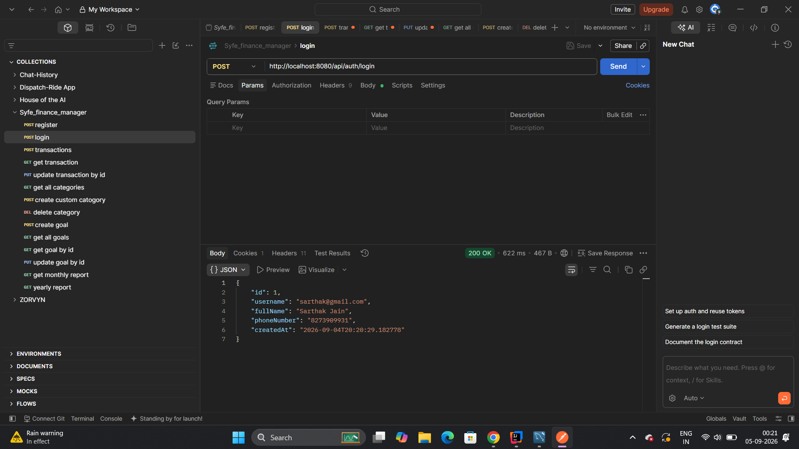
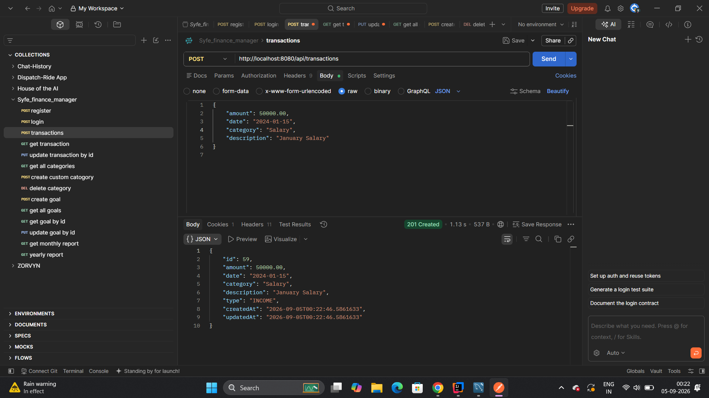
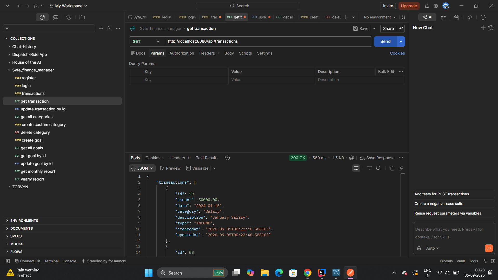
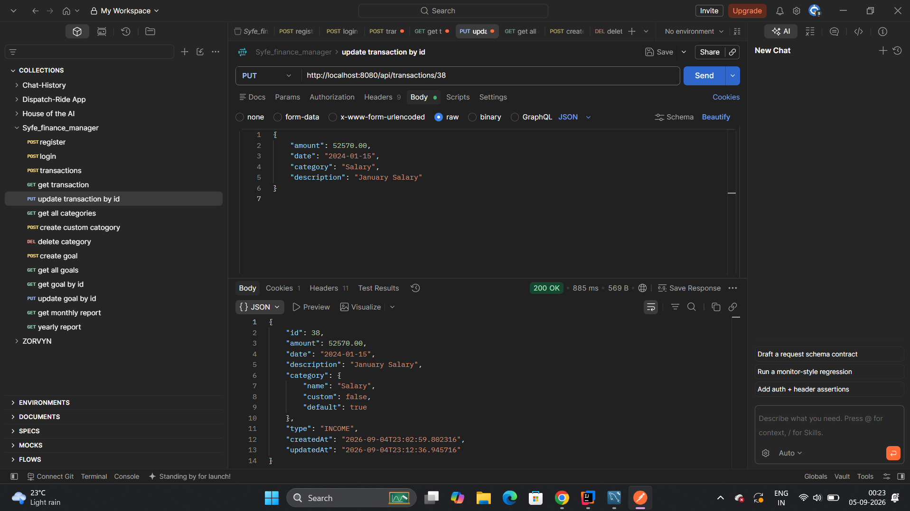
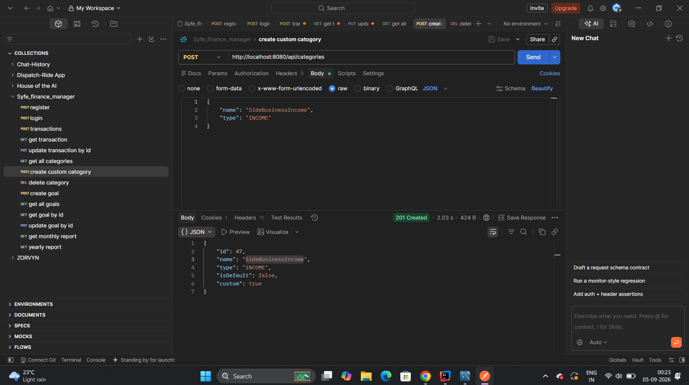
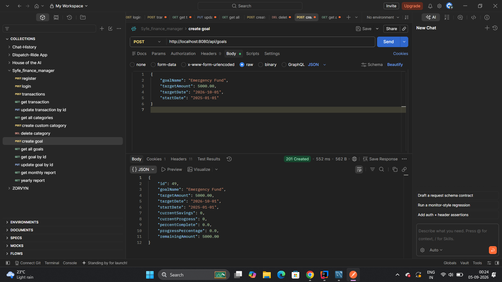
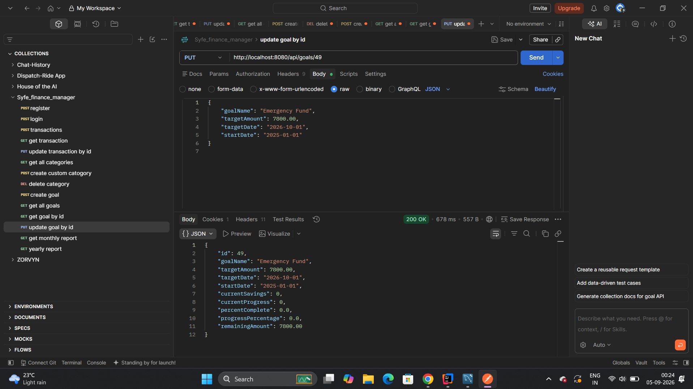
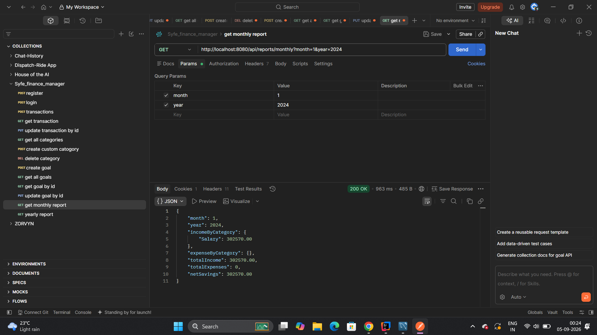
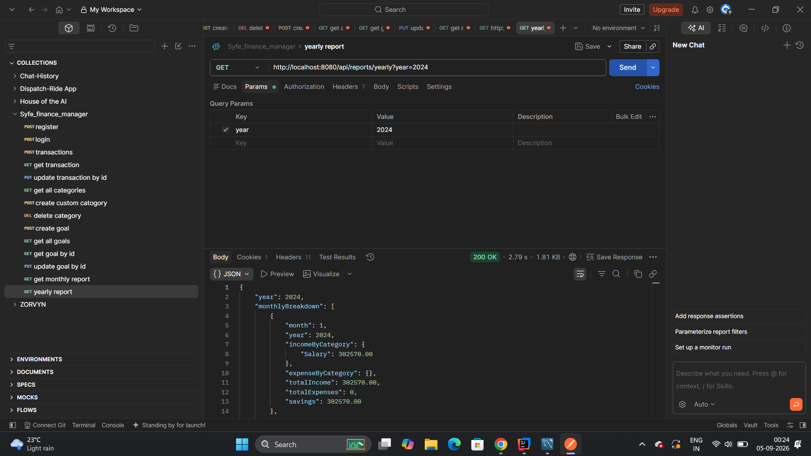

# Personal Finance Manager API

A robust, full-featured RESTful API for personal financial management built with **Spring Boot 3.4.1** and **Java 21**. The application enables users to track income and expense transactions, organize finances with standard and custom categories, track long-term savings goals with dynamic progress calculations, and generate monthly and yearly financial reports.

---

## Swagger API Documentation: 
## https://finance-manager-7zs4.onrender.com/swagger-ui/index.html

---

## API Screenshots & Visual Walkthrough

Below are screenshots demonstrating key API endpoints and functionality tested via Postman:

### 1. User Authentication & Session Management
- **User Login (`POST /api/auth/login`)**: Authenticates credentials and establishes session state.



---

### 2. Transaction Management
- **Add Transaction (`POST /api/transactions`)**: Record income or expense transactions.



- **Get All Transactions (`GET /api/transactions`)**: Retrieve user transactions with filtering and pagination.



- **Update Transaction (`PUT /api/transactions/{id}`)**: Update transaction details dynamically.



---

### 3. Category Management
- **Create Custom Category (`POST /api/categories`)**: Define personalized income or expense categories.



---

### 4. Savings Goals Tracker
- **Create Savings Goal (`POST /api/goals`)**: Set up target savings goals with target dates.



- **Update Savings Goal (`PUT /api/goals/{id}`)**: Modify target amounts and track progress percentages.



---

### 5. Financial Reports & Analytics
- **Monthly Financial Report (`GET /api/reports/monthly?month=1&year=2024`)**: Breakdown of income, expenses, and net savings for a specific month.



- **Yearly Financial Report (`GET /api/reports/yearly?year=2024`)**: Comprehensive monthly breakdown and annual financial analytics.



---

## Tech Stack

- **Language:** Java 21
- **Framework:** Spring Boot 3.4.1
- **Security:** Spring Security (Session-based Cookie Authentication)
- **Database:** PostgreSQL (Supports Supabase / Local Instance)
- **ORM / Persistence:** Spring Data JPA / Hibernate
- **Build & Dependency Management:** Maven
- **Testing:** Shell Automated Integration Test Suite (`financial_manager_tests.sh`)

---

## Getting Started

### Prerequisites

- **JDK 21** or higher
- **Maven 3.9+**
- **PostgreSQL** database instance

### 1. Clone & Configure

```bash
git clone https://github.com/sarthak-jain03/Finance-Manager.git
cd Finance-Manager
```

Configure your PostgreSQL database connection in `src/main/resources/application.properties`:

```properties
spring.datasource.url=jdbc:postgresql://localhost:5432/finance_db
spring.datasource.username=postgres
spring.datasource.password=yourpassword
spring.jpa.hibernate.ddl-auto=update
```

### 2. Build & Run Application

```bash
mvn clean package -DskipTests
mvn spring-boot:run
```

The application will start on `http://localhost:8080`.

---

## Swagger / OpenAPI Interactive Documentation

Once the application is running, you can access the live interactive Swagger UI and OpenAPI documentation at:

-  **Interactive Swagger UI**: [http://localhost:8080/swagger-ui.html](http://localhost:8080/swagger-ui.html) (or `http://localhost:8080/swagger-ui/index.html`)
-  **OpenAPI v3 JSON Spec**: [http://localhost:8080/v3/api-docs](http://localhost:8080/v3/api-docs)

---

## Key Features & API Endpoints

### Authentication (`/api/auth`)
- `POST /api/auth/register` — Register a new user account
- `POST /api/auth/login` — Login and establish session cookie
- `POST /api/auth/logout` — Invalidate user session

### Transactions (`/api/transactions`)
- `POST /api/transactions` — Add income or expense transaction
- `GET /api/transactions` — Filter transactions (`startDate`, `endDate`, `categoryId`, `type`)
- `GET /api/transactions/{id}` — Get transaction details
- `PUT /api/transactions/{id}` — Update description, amount, or category
- `DELETE /api/transactions/{id}` — Remove transaction

### Categories (`/api/categories`)
- `GET /api/categories` — View default and custom categories
- `POST /api/categories` — Create custom category
- `DELETE /api/categories/{id}` — Remove custom category

### Savings Goals (`/api/goals`)
- `POST /api/goals` — Set savings goal with target date and amount
- `GET /api/goals` — List goals with calculated progress
- `GET /api/goals/{id}` — Fetch goal status
- `PUT /api/goals/{id}` — Update target amount or target date
- `DELETE /api/goals/{id}` — Delete savings goal

### Financial Reports (`/api/reports`)
- `GET /api/reports/monthly?month=1&year=2024` — Get monthly summary (total income, total expense, category breakdown)
- `GET /api/reports/yearly?year=2024` — Get yearly financial overview

---

## Architectural & Design Notes

1. **Layered Structure:** Standard Controller-Service-Repository pattern. Services handle business logic while Controllers handle request/response mapping and validation.
2. **Session Security:** Spring Security manages HTTP sessions with HTTP-only cookies. Passwords are hashed using BCrypt.
3. **Data Isolation:** All data queries bind explicitly to the authenticated user retrieved from `SecurityContext`.
4. **Calculated Progress:** Goal progress is evaluated dynamically from transactions rather than stored as redundant state.
5. **Default Seeding:** Built-in default categories are auto-seeded on startup via `DataInitializer`.

---

## Error Handling

Standardized response format across all API exceptions:

```json
{
  "status": 400,
  "message": "Validation failed",
  "timestamp": "2026-09-05T00:10:00",
  "errors": {
    "amount": "Amount must be greater than zero"
  }
}
```

---

## Project Folder Structure

```
src/main/java/com/sarthak/finance/
├── config/              # App initialization & default seeding
├── controller/          # REST endpoints
├── dto/                 # Request & response models
├── exception/           # Custom exceptions & global exception handler
├── model/               # JPA Entity models
├── repository/          # Spring Data JPA repositories
├── security/            # Security configs, user details service
└── service/             # Business logic services
```

---

## Testing

To run the automated integration test suite against a running local instance:

```bash
chmod +x financial_manager_tests.sh
./financial_manager_tests.sh
```

## Tests Passed:


